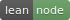

Lean Node.js
--
Lean Node.js Resources - The Essentials

 

Node.js
---
- [Node.js](https://nodejs.org/en/)
- [About | Node.js](https://nodejs.org/en/about/)
- [Download | Node.js](https://nodejs.org/en/download/)
- [Chrome's V8 JavaScript engine](https://v8.dev/)
- [Docs | Node.js](https://nodejs.org/en/docs/)
- [Node.js Documentation](https://nodejs.org/api/)
- [Get involved | Node.js](https://nodejs.org/en/get-involved/)
- [Guides | Node.js](https://nodejs.org/en/docs/guides/)
- [Dependencies | Node.js](https://nodejs.org/en/docs/meta/topics/dependencies/)
- [Node.js Monthly Newsletter](https://us14.campaign-archive.com/home/?u=c7c2e114a827812354112c23b&id=f006b61f29)
- [NPM - Node Package Manager](https://www.npmjs.com/)

Release Notes
---
- [Releases | Node.js](https://nodejs.org/en/about/releases/)
- [Previous Releases | Node.js](https://nodejs.org/en/download/releases/)
- [nodejs.org/en/blog](https://nodejs.org/en/blog/)
- [Releases · nodejs/node](https://github.com/nodejs/node/releases)
- [node/doc/changelogs at master · nodejs/node](https://github.com/nodejs/node/tree/master/doc/changelogs)

Tutorials
---
- [NodeSchool](https://nodeschool.io/)
- [learnyounode](https://github.com/workshopper/learnyounode)
- [The Art of Node](https://github.com/maxogden/art-of-node)
- [Node.js Tutorial - Tutorialspoint](https://www.tutorialspoint.com/nodejs/index.htm)
- [Node.js Best Practices](https://github.com/goldbergyoni/nodebestpractices)

Videos
---
- [Ryan Dahl: Original Node.js presentation](https://www.youtube.com/watch?v=ztspvPYybIY)
- [Introduction to Node.js with Ryan Dahl](https://www.youtube.com/watch?v=jo_B4LTHi3I)

Books
---
- [Practical Node.js: Building Real-World Scalable Web Apps 2nd ed. Edition by Azat Mardan](https://www.amazon.com/Practical-Node-js-Building-Real-World-Scalable/dp/1484230388)
- [Node.js in Action 2nd Edition by  Alex R. Young, Bradley Meck, Mike Cantelon, Tim Oxley, Marc Harter, TJ Holowaychuk, Nathan Rajlich](https://www.amazon.com/Node-js-Action-Alex-R-Young/dp/1617292575)

Node.js Experts
---
- [Ryan Dahl](https://tinyclouds.org/)
- [TJ Holowaychuk](http://tjholowaychuk.com/)
- [Sindre Sorhus](https://sindresorhus.com/)
- [Guillermo Rauch](https://rauchg.com/)

Node.js Security
---
- [Link 1](https://nodejs.org/en/security/)
- [Signed SHASUMS for release files (How to verify)](https://github.com/nodejs/node#verifying-binaries)
- [Node.js - Bug Bounty Program | HackerOne](https://hackerone.com/nodejs)
- [NPM - Security Advisories](https://www.npmjs.com/advisories)

Events
---
- [Node.js Meetups | Node.js](https://nodejs.org/en/get-involved/node-meetups/)

Node.js Frameworks
---
- [Express - Node.js web application framework](https://expressjs.com/)
- [Socket.IO](https://socket.io/)
- [Sails.js | Realtime MVC Framework for Node.js](https://sailsjs.com/)

Sample Apps
---
- [node-express-realworld-example-app](https://github.com/gothinkster/node-express-realworld-example-app)

